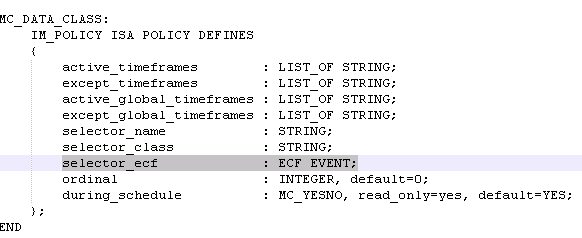
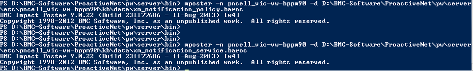
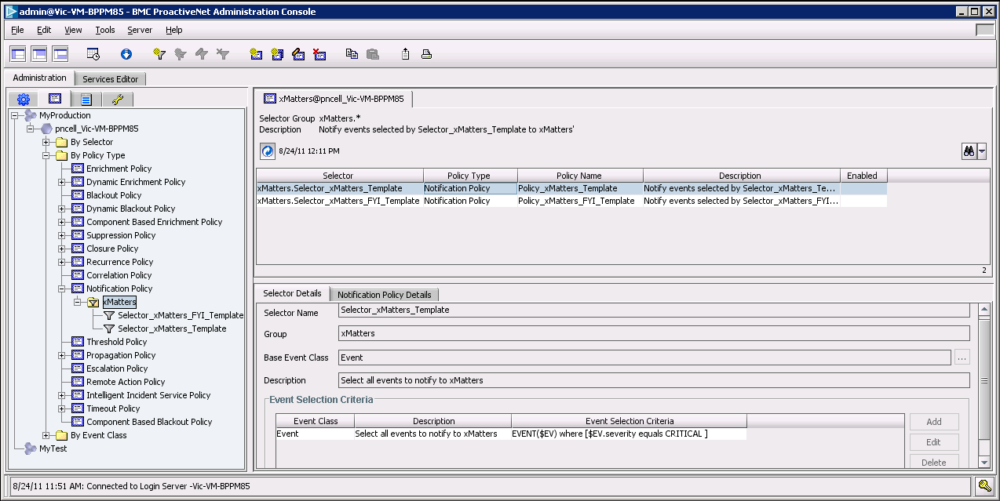
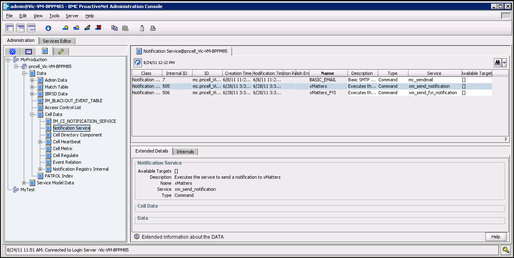

# BMC ProactiveNet Performance Management and BMC TrueSight
This article provides installation, configuration, and implementation details for integrating xMatters On-Demand with BMC ProactiveNet Performance Management (BPPM) version 9.x. This integration has also been successfully deployed with BMC TrueSight, the latest version of/successor to BMC BPPM. Additional configuration steps for BMC TrueSight integrations are noted in the text.

# Pre-Requisites
* An account and login information for BPPM (v9.0.5, v9.5 or v9.6)
* Access to the BPPM server to install the xMatters integration agent
* Access to your xMatters On-Demand environment and the ability to create communication plans
* A xMatters Integration Agent that is connected to the xMatters OnDemand instance

# Files
* [BMCBPPMIntegration30.zip](BMCBPPMIntegration30.zip) - xMatters Communication Plan
* [bmc-bppm](bmc-bppm) - This folder contains bmc-bppm related files
* [integration-agent](integration-agent) - This folder contains integration agent related files

# How it works
Add some info here detailing the overall architecture and how the integration works. The more information you can add, the more helpful this sections becomes. For example: An action happens in Application XYZ which triggers the thingamajig to fire a REST API call to the xMatters inbound integration on the imported communication plan. The integration script then parses out the payload and builds an event and passes that to xMatters.

# Installation
Details of the installation go here.

## Configure xMatters
The first step in setting up your integration is to configure xMatters.

### Create an integration user
This integration requires a user who can authenticate REST web service calls when injecting events.

This user needs to be able to work with events, but does not need to update administrative settings. While you can use the default Company Supervisor role to authenticate REST web service calls, the best method is to create a user specifically for this integration with the "REST Web Service User" role that includes the required permissions and capabilities.

**Note**: If you are installing this integration into an xMatters trial instance, you don't need to create a new user. Instead, locate the "Integration User" sample user that was automatically configured with the REST Web Service User role when your instance was created and assign them a new password. You can then skip ahead to the next section.

It is recommended that you use the following formats for the REST API user's User ID:
* **bppm-rest-company-name-np** for your xMatters non-production environment
* **bppm-rest-company-name** for your xMatters production environment.

**To create a REST API user:**
1. Log in to the target xMatters system.
2. On the Users tab, click the Add New User icon.
3. Enter the appropriate information for your new user.
4. Assign the REST Web Service User role to the user.
5. Click Save.
6. On the next page, set the web login ID and password.
7. Make a note of these details; you will need them when configuring other parts of this integration.

### Import the communication plan
The next step is to import the communication plan.

**To import the communication plan:**
1. In the target xMatters system, on the Developer tab, click Import Plan.
2. Click Browse, and then locate the following file within the extracted integration archive:
[BMCBPPMIntegration30.zip](BMCBPPMIntegration30.zip)
3. Click Import Plan.
4. Once the communication plan has been imported, click Plan Disabled to enable the plan.
5. In the Edit drop-down list, select Forms.
6. For the BPPM Incident form, in the Not Deployed drop-down list, click Create Event Web Service.
    * After you create the web service, the drop-down list label will change to Web Service Only.
7. In the Web Service Only drop-down list, click Permissions.
8. Enter the integration user you configured above, and then click Save Changes.

### Endpoint Permissions
1. From within xMatters, navigate to the Developer tab
2. Of the BMC BPPM TrueSight communication plan select Edit > Integration Builder
3. From within the Integration Builder tab, select Edit Endpoints
4. Assign the xMatters REST API user to the xMatters endpoint

### Accessing Web Service URL
To retrieve the Web Service URL:
1. From within xMatters, navigate to the Developer tab
2. Of the BMC BPPM TrueSight communication plan select Edit > Integration Builder
3. Select the Inbound integration builder
4. Scroll to the bottom of the screen to find the URL

**Note**: Ensure that the Inbound Integration Builder has the authentication set to Basic

You'll need these URLs when you configure the rest of the integration.

### Configure the Event Domain
1. Navigate to the Developer tab
2. On the lefthand side select Event Domains below Domains
3. From within Event Domains, select applications
4. Scroll to the bottom and select **Add New**
5. For the Name field enter: **bmcbppm30**.
6. Leave everything else blank and then select Save.

## Configure the Integration Agent
Now that you've configured xMatters On-Demand, it's time to configure the integration agent. This section assumes you have a successfully connected Integration Agent.

**Note**: In the following instructions, <IAHOME> refers to the installation folder of the integration agent. For example, C:\xMatters\integrationagent

### Install the Integration Package
The installation package contains all that you need to configure the integration.

**To install the package:**
1. Within the extracted integration archive, navigate to: [bmcbppm30](integration-agent/integrationservices)
2. Copy the bmcbppm30 folder to the `<IAHOME>\integrationservices` directory.
3. Open the `<IAHOME>/conf/IAConfig.xml` file and add the following line to the "service-configs" section:
    * `<path>bmcbppm30/bmcbppm.xml</path>`
4. Save and close the file.
5. Open the `configuration.js` file found in the `<IAHOME>\integrationservices\bmcbppm30` folder and add or set the values for the following variables:
    * **WEB_SERVICE_URL**: See [Accessing Web Service URL's](https://github.com/matthewhenry1/xm-labs-bmc-bppm-truesight#accessing-web-service-url)
    * **BPPM_CELL**: Name of the BPPM cell
    * **IIWS_URL**: BMC Impact Integration Web Services endpoint
    * **INITIATOR**: The User ID of the integration user you configured in xMatters.
    * **PASSWORD**: Path and filename of the password file containing the encrypted REST API user's password. For more information about creating this file, see Setting password files, below.
    * **DEDUPLICATOR_FILTER_NAME**: Must be set to "bmcbppm30" for this integration.
    * **ANNOTATE_DELIVERY**: true or false - indicates whether to include xMatters delivery annotations in BPPM event logs/notes
    * **MAP_XM_PRIORITY**: Indicates which BPPM value to map to xMatters priority levels; valid values are:
      * priority
      * severity
      * none
    * **REST_SERVICE_URL**: The xMatters REST API URL; Replace the <company> and <environment> placeholders with the company name and environment of your xMatters instance URL.
6. Save and close the file.
7. Open the `deduplicator-filter.xml` file found in the `<IAHOME>\integrationservices\conf`folder and add the duplicator filter (everything from `<filter name="bmcbppm30">` to and including `</filter>`) found in the [bmcbppm30](integration-agent/conf) file in the same folder.
8. Save and close the file.
9. Restart the integration agent.

### Setting password files
 This integration includes an encrypted password file, located in the `<IAHOME>\integrationservices\bmcbppm30` folder that stores the password for the REST API user. You will need to create the file with the correct password for the REST API user you created above.

**To configure the REST API user password:**

1. Open a command prompt and navigate to `<IAHOME>\bin`
2. Run the following command, where `<password>` is the password for the `INITIATOR` user specified in the `<IAHOME>\integrationservices\bmcbppm30\configuration.js` file:
```
iapassword.bat --new <password> --file integrationservices/bmcbppm30/.initiatorpasswd
```
For more information about working with the iapassword command, and creating password files, refer to the xMatters integration agent guide.

## BMC BPPM and BMC TrueSight
Now that you've configured xMatters to integrate with your system, it's time to configure your system to integrate with xMatters.

If you are integrating with BMC TrueSight, you will also need to ensure that the BMC Impact Integration Web Services product is installed on your deployment. This is a BPPM component, and may not be included in a TrueSight installation, but it is compatible with TrueSight and is a required target for this integration.

### Deploying integration files
The following variables refer to specific paths used within this section’s examples:

* $CELL refers to the integrated cell name
* $xM_CMD refers to the extracted [bmc-bppm](bmc-bppm\xM Commands Files)
* $xM_KB refers to the extracted [bmc-bppm](bmc-bppm\kb)
* $KB refers to the `\pw\server\etc\$CELL\kb` folder in the BMC BPPM installation directory

**Note**: For Unix installations, commands should be executed in the /opt/mcell/bin directory, unless this path has been added to the $PATH variable.

### Deploying the xMatters command files
1. In the extracted integration archive folder, locate the `xm_send_notification` and `xm_delete_notification` files; by default, they are located in the `$xM_CMD\windows` or `$xm_CMD\linux` directory.
2. Open each file in a text editor and ensure the path of the xMatters integration agent is correct.
3. Copy both files to the `$KB\bin\w4` (Windows) or `$KB\bin\l2` (Linux) folder containing the command files on the integrated cell.

**Note**: The account under which the cell is running must have permission to execute the command files.

### Deploying Baroc and Rule files
The next step is to deploy the .baroc and .mrl integration files into the $KB directory of the integrated cell. Load the following files into their appropriate directories on the integrated cell.

**Note**: The .load files to be modified are read-only; their file properties must be changed before you can edit them.

`xm_actions.mrl` (located in $xM_KB\bin)

1. Copy this file to $KB\bin.
2. Add a line containing “xm_actions” to the .load file located in $KB\bin.

**Note**: The Actions defined in `xm_actions.mrl` allow users to manually send notifications to xMatters, and to request that a notification in xMatters be stopped. The action definitions include the roles that users must have assigned to them in order to access these actions in the Operations Console. Review the roles specified in `xm_actions.mrl` and ensure that they match the roles assigned to users who should have access to these actions.

`xm_classes.baroc` (located in $xM_KB\classes)

1. Copy these files to $KB\classes.
2. Add a line containing “xm_classes” to the .load file located in $KB\classes.
    * If this line already exists, ensure that it is not commented out.

`xm_collectors.mrl` (located in $xM_KB\collectors)

1. Copy this file to $KB\collectors.
2. Add a line containing “xm_collectors” to the .load file located in $KB\collectors.

`m_associate.mrl` (located in $xM_KB\rules)

1. Copy this file to $KB\rules.
2. Add a line containing “xm_associate” to the .load file located in $KB\rules.

**Known issue with BPPM event targeted recipient as "-mp"**

There is a known issue due where the BPPM event notification adds an additional parameter to the injection parameters. Refer to this [BMC Knowledge Base article](https://bmcsites.force.com/casemgmt/sc_KnowledgeArticle?sfdcid=kA411757) to update im_internal.mrl to correct this issue. *(Note: The location of the article changed, and the link has been updated as of September 19, 2016. If the link becomes inaccessible, refer to the BMC-BPPM-KBA411757.pdf file attached to this article.)*

BMC TrueSight `.baroc` file changes

To avoid a specific compilation issue when deploying this integration on BMC TrueSight, update the `im_policies.baroc` file.

1. Locate the `im_policies.baroc` file within your TrueSight installation and open it a text editor.
2. Locate the slot `selector_ecf` definition, and change the definition from `ECF CORE_EVENT;` to `ECF EVENT;`
3. Save and close the file.
    * The section should now resemble the following:

<kbd>
  
</kbd>

### Compiling files
Execute the following command to re-compile the files added to the $KB directory of the integrated cell (mccomp is located in the `\pw\server\bin` folder within the BPPM installation directory):

`mccomp -n $CELL`
If the command executed properly, the last line should state: “Compilation ended successfully”

`xm_notification_policy.baroc` and `xm_notification_service.baroc` (located in `$xM_KB\data`)

1. Copy these files to $KB\data.
2. To load the contents of these files into the BMC IM database, execute the following commands.
    * This command creates inactive Notification Policies which can be used as templates for new Notification Policies:
    ```
    mposter -n $CELL -d $KB\data\xm_notification_policy.baroc
    ```
    * This command creates Notifications Services that will be used by your new Notification Policies:
    ```
    mposter -n $CELL -d $KB\data\xm_notification_service.baroc
    ```
Successful execution of these commands should result in the following output:

<kbd>
  
</kbd>

After completing the above steps, restart the BMC BPPM server.

**To review the Notification Policies**:

1. Launch the BMC ProactiveNet Administration Console.
2. Under the Administration tab, click the **Event Management Policies** tab.
3. Open the production node for your BPPM cell.
4. Open the **By Policy Type** folder, and then open the **Notification Policy** folder.

Inside the Notification Policy folder should be a folder called xMatters, containing the selector called "Selector_xMatters_Template". This selector should have Notification Policy details referring to a policy called "Policy_xMatters_Template".

<kbd>
  
</kbd>

The Notification Policies should also reference a Notification Service called "xMatters".

**To review the Notification Services**:

1. Launch the BMC ProactiveNet Administration Console.
2. Under the Administration tab, click the **Dynamic Data Editor** tab.
3. Open the production node for your BPPM cell.
4. Open the nodes **Data** and **Cell Data**, then click on the node **Notification Service**.

This should display a list of Notification Services, including a service named "xMatters".

<kbd>
  
</kbd>

### Configuring notifications
After installing the integration, you must create your own Selectors and Notification Policies using the ProactiveNet Administration Console, or by creating and compiling baroc files in your BPPM Knowledge Base. You can use the template Selectors and Notification Policies as a starting point, or you can define your own Selectors and Notification Policies provided the Notification Policies you create refer to the xMatters Notification Service provided with the integration.

The xMatters and Notification Service can be used without modification and must be the Notification Service associated with any Notification Policy intended to forward events to xMatters.

If you create Notification Policies by copying the template Notification Policy supplied with the integration, make sure you enable your new Notification Policies.

**Note**: For more information on defining Event Management Policies, see the BPPM documentation.

## Validate the integration
After configuring xMatters and BPPM, you can validate that communication is properly configured. It is recommended that you start the components in the following order:

* BMC ProactiveNet Performance Management
* BMC Impact Integration Web Services
* xMatters integration agent (version 5.1.4 or newer)
Consult the respective user manuals for details on starting these applications.

The following sections will test the combination of xMatters and BPPM for notification delivery and response.

### Triggering a notification
xMatters for BPPM enables you to send manual and automatic notifications from BPPM to xMatters. For both validation scenarios, confirm that you have a sample user in xMatters to use as a notification recipient.

#### Triggering a manual notification

Use the following steps to trigger a manual notification.

To send a manual notification:

1. Log in to the BPPM Operations Console.
2. In the All Event Collectors pane, select the event for which you want to send a manual notification.
3. Click the **Tools** icon for the event, and then select **Remote Actions/Diagnostics** > **xMatters - send Notification**.
4. In the Execute Action dialog box, enter the ID of the xMatters recipient you want to notify, and then click **Execute**.

#### Triggering automatic notifications

Use the following steps to configure and send automatic notifications.

To send automatic notifications:

1. Log in to the BMC ProactiveNet Administration Console, and then select **Administration** > **Event Management Polices**.
2. To open the folders or nodes for your production cell, click **By Policy Type** > **Notification Policy** > **xMatters**.
3. Select **Selector_xMatters_Template**, and then select **Copy and Add Event Policy**.
4. Type a **Policy Name**, such as xMatters_Notification, and then enable the Policy.
5. Verify the Notification Service is xMatters.
6. Edit the **Users to Notify** field, and add the User ID of the xMatters recipient you want to notify.
7. Click **OK** to save the new Notification Policy.
8. Click the **Selector Details** tab, and then click **Update Event Selector**.
9. Modify the selector criteria so the event severity is smaller than or equal to CRITICAL.
10. Click **OK** again to save changes.

Once you have configured the automatic notification, generate a new event in your BPPM cell that will cause the recipient to receive a notification.

To view the event notification:

1. In the BPPM Operations Console., in the Navigation Pane, open **All Event Collectors** > **Notified Events** > **xMatters** and locate the event you generated.
2. Select the event, and then expand the **Logs and Notes** panel in the Details pane.
3. Ensure that there is an entry in the Operations Log stating that a NOTIFICATION_REQUEST was submitted to xMatters.
4. Close the Logs and Notes panel and wait for 30 seconds.
5. Re-open the panel and check the Operations Log. There should be entries confirming SUCCESSFUL_DELIVERY by xMatters to the User Devices.

# Notes & Troubleshooting
In an older installation document, the following note appeared:
*BPPM v9.5 and v9.6 require a known workaround from BMC, which has been documented here: https://kb.bmc.com/infocenter/index?page=content&id=KA411757&actp=search&viewlocale=en_US&searchid=1416520611157*
However, the BMC URL has been deprecated. It is unknown what may be required.

If necessary, attached is the old integration documentation. This may be beneficial if issues arise during the configuration of BMC BPPM TrueSight. See [xm_bmc_bppm_v20.pdf](xm_bmc_bppm_v20.pdf)
